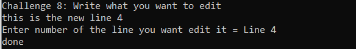

# lab3 system.IO

    this project can do 9 things i sort it in table.

 Challenge|title
 ---- | ------
Challenge1|[multiplied three number](#challenge-1-multiplied-three-number)
Challenge2|[Average three number](#challenge-2-average-three-number)
Challenge3|[Print Stars](#challenge-3-print-stars)
Challenge4|[Most frequent Number](#challenge4--most-frequent-number)
Challenge5|[Max Number](#challenge-5-max-number)
Challenge6|[Write on file ](#challenge-6-write-on-file)
Challenge7|[Read from File](#challenge-7-read-from-file)
Challenge8|[Edit File](#challenge-8-edit-file)
Challenge9|[Split String ](#challenge-9-split-string)

------

## Challenge 1: multiplied three number
this code ask user to input 3 number in `one Line` and return the multiply for this three number

## Challenge 2: Average three number
this code asks user to input numbers between 2-10 and get out a `random numbers` by number user input and get the average of this random number and return the result.
 

## Challenge 3: Print Stars
Print on console rhombus shape stars. 

## Challenge4 : Most frequent Number 
return **the most appears** number of given array of interger

Example array:  
in this array `{ 1, 5, 1, 3, 6, 7, 7, 5, 7, 3 ,90,5,5,5,5,5,5,8,9,12,34}` 

 

## Challenge 5: Max Number 
return **Max number** of given array of interger

Example array:  
in this array `{ 1, 5, 1, 3, 6, 7, 7, 5, 7, 3 ,90,5,5,5,5,5,5,8,9,12,34}`  

## Challenge 6: Write on file 
Write **input user** on file store on the same project path 

## Challenge 7: Read from File
Read the Contents from **same File** that we [store before](#challenge-6-write-on-file).

## Challenge 8: Edit File
edit the spasific line content from **same File** that we [store before](#challenge-6-write-on-file).

 

## Challenge 9: Split String 
Split String for an array that content word and how many characters in the word

